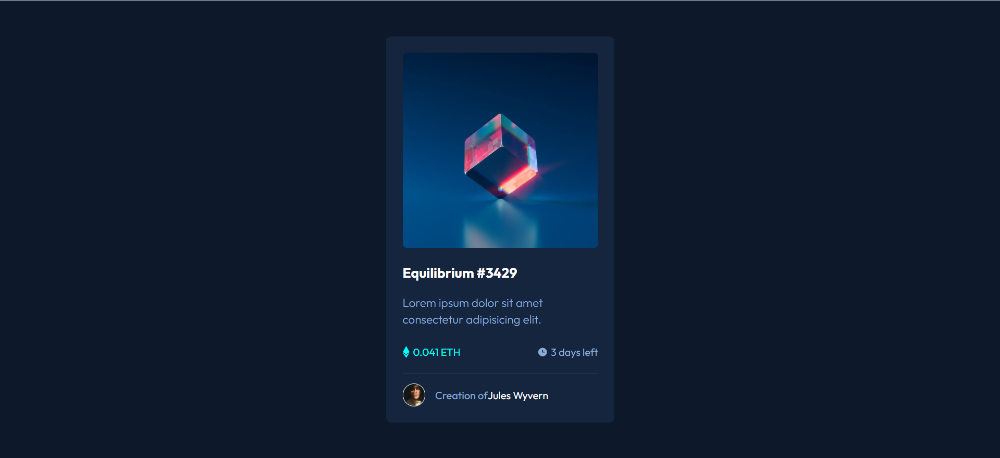
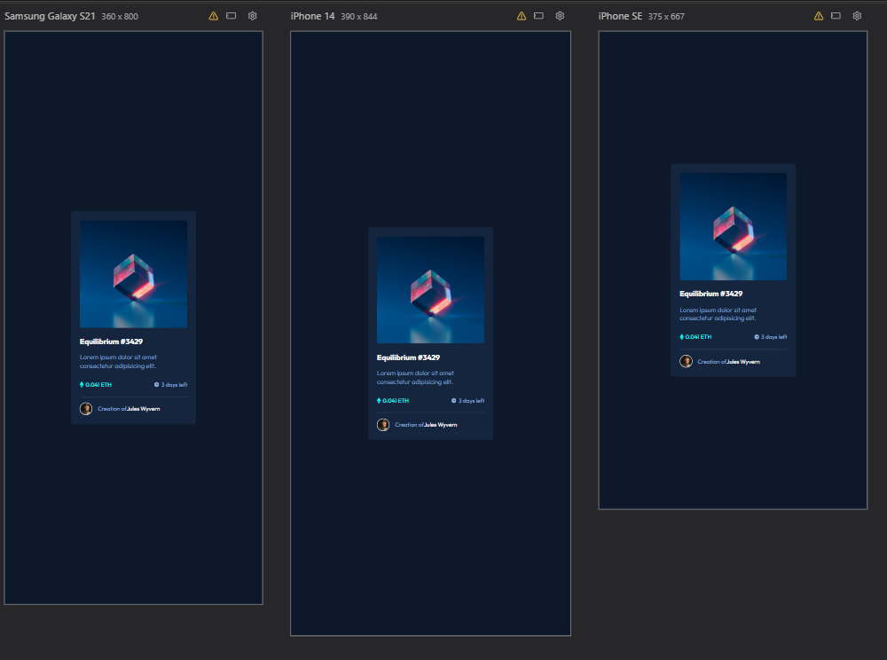

# NFT Preview Card Component

Um componente de card para preview de NFT responsivo e moderno, desenvolvido com HTML e CSS puro.

## 📋 Índice

- [Sobre o Projeto](#sobre-o-projeto)
- [Preview](#preview)
- [Tecnologias Utilizadas](#tecnologias-utilizadas)
- [Funcionalidades](#funcionalidades)
- [Estrutura de Arquivos](#estrutura-de-arquivos)
- [Como Usar](#como-usar)
- [Aprendizados](#aprendizados)
- [Agradecimentos](#Agradecimentos)
- [Autor](#autor)

## 🎯 Sobre o Projeto

Este projeto consiste em um componente de card para visualização de NFTs (Non-Fungible Tokens), desenvolvido como exercício prático de HTML e CSS. O card apresenta informações essenciais sobre o NFT, incluindo imagem, título, descrição, preço em ETH, tempo restante e informações do criador.

## 🖼️ Preview




## 🚀 Tecnologias Utilizadas

- **HTML5** - Estrutura semântica
- **CSS3** - Estilização e animações
- **Google Fonts** - Tipografia (Outfit)
- **CSS Variables** - Gerenciamento de cores e temas
- **Flexbox** - Layout responsivo

## ✨ Funcionalidades

- ✅ Design responsivo e moderno
- ✅ Hover effects na imagem do NFT
- ✅ Overlay com ícone de visualização ao passar o mouse
- ✅ Transições suaves (0.3s ease-in-out)
- ✅ Uso de pseudo-elementos (::before e ::after)
- ✅ Sistema de cores organizado com CSS Variables
- ✅ Ícones integrados via background-image
- ✅ Layout centralizado com Flexbox

## 📁 Estrutura de Arquivos

```
nft-card-component/
│
├── index.html
├── README.md
│
└── src/
    ├── css/
    │   ├── reset.css
    │   ├── variables.css
    │   └── style.css
    │
    └── images/
        ├── favicon-32x32.png
        ├── image-equilibrium.jpg
        ├── image-avatar.png
        ├── icon-view.svg
        ├── icon-ethereum.svg
        └── icon-clock.svg
```

## 💻 Como Usar

### Pré-requisitos

- Navegador web moderno
- Editor de código (opcional, para modificações)

### Instalação

1. Clone o repositório
```bash
git clone https://github.com/seu-usuario/nft-card-component.git
```

2. Navegue até o diretório do projeto
```bash
cd nft-card-component
```

3. Abra o arquivo `index.html` no seu navegador
```bash
# No Windows
start index.html

# No macOS
open index.html

# No Linux
xdg-open index.html
```

Ou simplesmente arraste o arquivo `index.html` para o navegador.

## 🎨 Paleta de Cores

O projeto utiliza CSS Variables para fácil customização:

```css
--primary-soft: hsl(215, 51%, 70%)     /* Azul suave */
--primary-medium: hsl(178, 100%, 50%)   /* Ciano */
--neutral-dark: hsl(217, 54%, 11%)      /* Fundo escuro */
--neutral-medium: hsl(216, 50%, 16%)    /* Card background */
--neutral-soft: hsl(215, 32%, 27%)      /* Linha divisória */
```

## 📚 Aprendizados

Durante o desenvolvimento deste projeto, foram praticados:

- Uso de pseudo-elementos `::before` e `::after` para efeitos visuais
- Implementação de hover effects com overlays
- Organização de CSS com arquivos separados (reset, variables, style)
- Uso de CSS Variables para manutenção facilitada
- Background-image para ícones SVG
- Flexbox para centralização e layout
- Transições CSS para animações suaves

## Agradecimentos🙏

Quero deixar meus agradecimentos especiais a:

Claude AI, pela ajuda durante o desenvolvimento do redme, e respostas sobre dúvidas decorrentes no exercício.

Curso Dev Quest 2.0, por fornecer uma base sólida de estudo e prática.

Frontend Mentor, pela disponibilização dos desafios que incentivam a evolução contínua.

## 👨‍💻 Autor

Feito com 💙 por Marc0sVeiga

---

## 📝 Licença

Este projeto está sob a licença MIT. Sinta-se livre para usar, modificar e distribuir.

---
⭐ Se este projeto te ajudou, considere dar uma estrela no repositório!